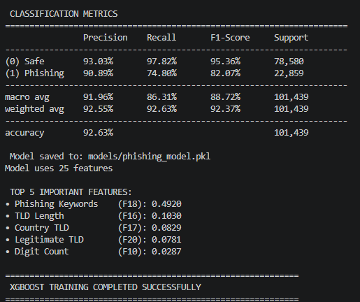
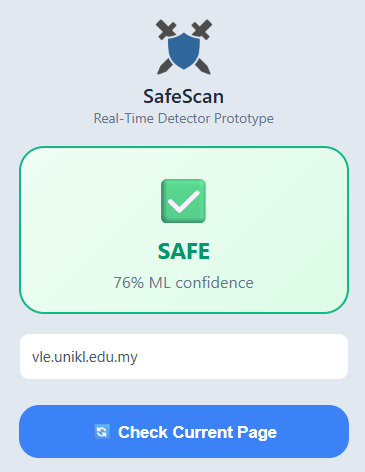
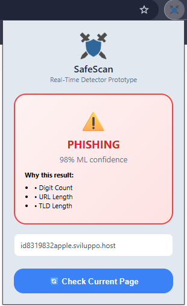
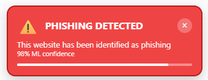
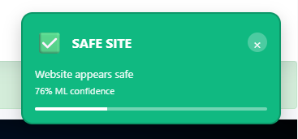
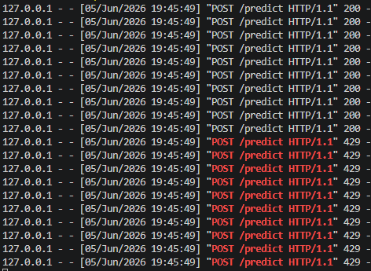
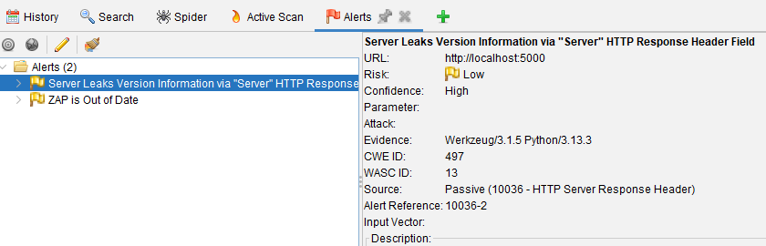

# SafeScan: Real-Time Phishing URL Detection Using Machine Learning

## Project Overview

SafeScan is a Final Year Project (FYP) developed to detect phishing URLs in real time using Machine Learning techniques. The system integrates an XGBoost classification model with a Google Chrome Extension and Flask backend API to provide instant phishing detection and user warnings during web browsing.

Phishing attacks remain one of the most common cybersecurity threats, often tricking users into revealing sensitive information through malicious websites. SafeScan aims to improve user awareness and online security by automatically analyzing URLs and identifying potential phishing attempts before users interact with harmful websites.

---

## Project Objectives

* Identify important URL-based features associated with phishing websites.
* Develop a machine learning model for phishing URL classification.
* Integrate the trained model into a Google Chrome Extension.
* Evaluate the effectiveness of real-time phishing URL detection.
* Improve user awareness and protection against phishing attacks.

---

## Key Features

* Real-time phishing URL detection
* XGBoost machine learning classifier
* URL feature extraction and analysis
* Confidence score prediction
* Google Chrome Extension integration
* Flask REST API backend
* Automatic phishing warning notifications
* OWASP ZAP security assessment
* DoS attack mitigation using rate limiting

---

## Technologies Used

### Programming Languages

* Python
* JavaScript
* HTML
* CSS

### Frameworks and Libraries

* Flask
* Flask-CORS
* Flask-Limiter
* XGBoost
* NumPy
* Joblib

### Security Tools

* OWASP ZAP
* Custom DoS Testing Script

### Platform

* Google Chrome Extension

---

## System Architecture

```text
User Browser
      │
      ▼
Chrome Extension
      │
      ▼
Flask API Backend
      │
      ▼
Feature Extraction
      │
      ▼
XGBoost ML Model
      │
      ▼
Prediction Result
      │
      ▼
User Notification
```

---

## Project Structure

```text
Real-Time-Phishing-URL-Detection-Using-Machine-Learning
│
├── chrome_extension/
│   ├── background.js
│   ├── content.js
│   ├── manifest.json
│   ├── popup.html
│   ├── popup.js
│   └── icons/
│
├── models/
│   └── phishing_model.pkl
│
├── screenshots/
│
├── src/
│   ├── features.py
│   ├── predict.py
│   ├── prepare_dataset.py
│   └── train_model.py
│
├── server.py
├── dos_test.py
├── README.md
└── .gitignore
```

---

## Machine Learning Model

SafeScan uses the XGBoost machine learning algorithm to classify URLs as either legitimate or phishing. The model was trained using phishing URL datasets and URL-based feature extraction techniques.

The trained model is stored in:

```text
models/phishing_model.pkl
```

The training datasets are excluded from this repository to reduce repository size and improve maintainability.

---

## Project Screenshots

### Machine Learning Model Training



### Safe URL Detection



### Phishing URL Detection



### Automatic Warning Popup



### Browser Extension Interface



### DoS Attack Testing



### OWASP ZAP Security Assessment



---

## Security Validation

The system was evaluated using several security testing approaches:

### OWASP ZAP Assessment

OWASP ZAP was used to identify common web application vulnerabilities and security misconfigurations within the Flask backend API.

### DoS Attack Simulation

A custom DoS testing script was developed to generate multiple requests against the backend API and evaluate the effectiveness of the implemented rate-limiting mechanism.

### Rate Limiting Protection

Flask-Limiter was integrated into the backend server to mitigate excessive requests and improve resilience against denial-of-service attacks.

---

## Results

The developed system successfully:

* Detects phishing URLs in real time.
* Provides confidence-based predictions.
* Warns users before accessing malicious websites.
* Integrates seamlessly with Google Chrome.
* Demonstrates improved resilience through security testing.

---

## Future Improvements

* Webpage content analysis.
* Network traffic analysis.
* Multi-browser support.
* Mobile platform support.
* Enhanced phishing explainability.
* Improved user experience and warning mechanisms.

---

## Author

**Muhammad Fitri Bin Mohd Aris**

Bachelor of Information Technology (Hons) in Computer System Security (BCSS)

Universiti Kuala Lumpur Malaysian Institute of Information Technology (UniKL MIIT)

Academic Year: 2026

---

## Disclaimer

This repository was developed for academic and educational purposes as part of a Final Year Project (FYP). The project is intended for cybersecurity research, learning, and demonstration purposes only.


